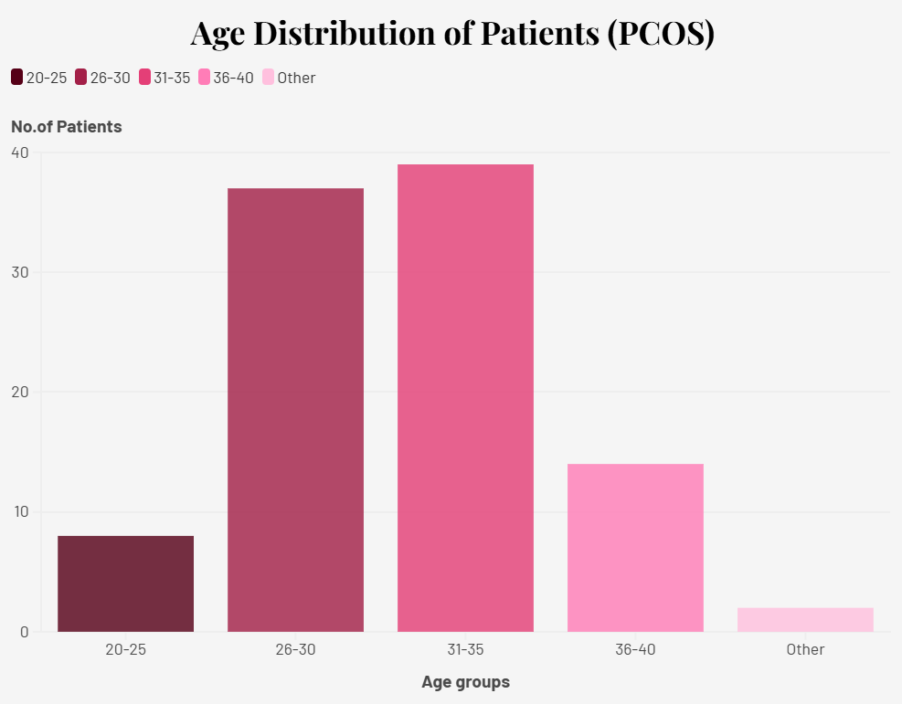
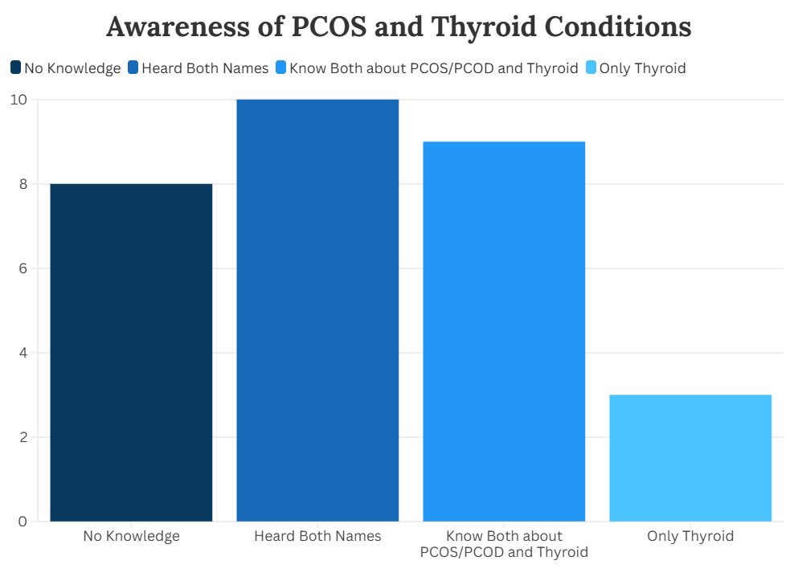
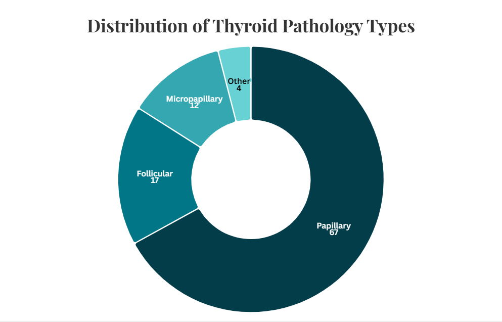
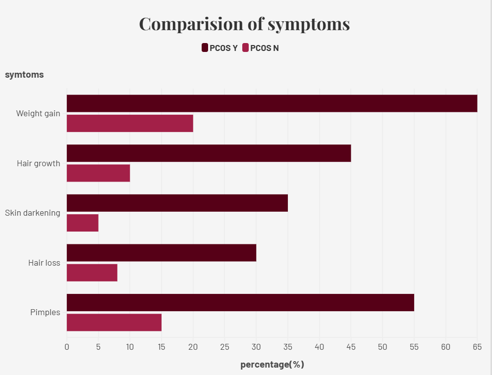
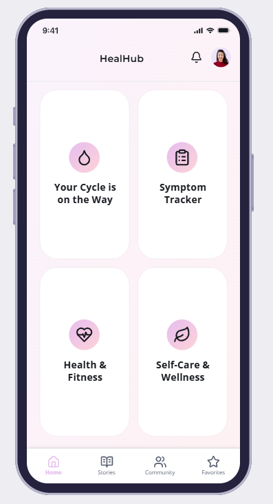
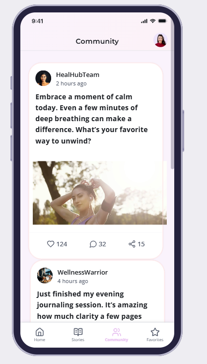
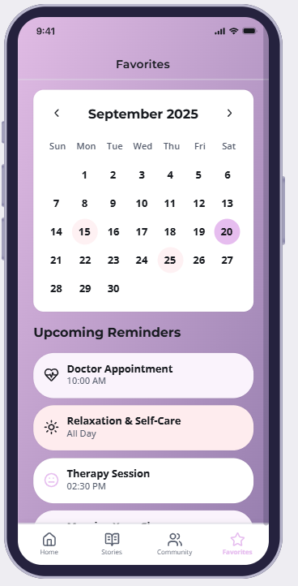
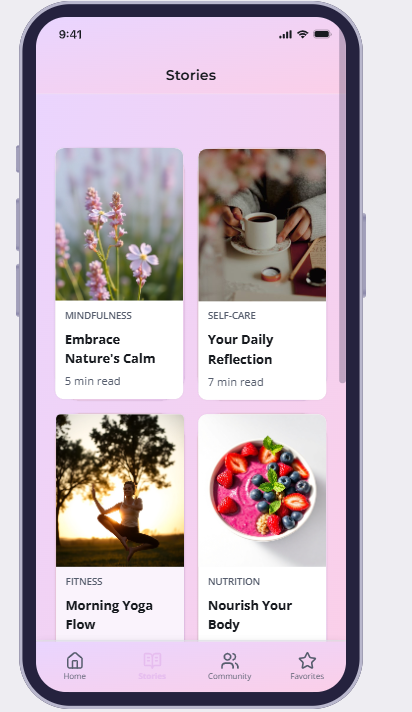

# Silent Battles: PCOS & Thyroid Awareness  
🏆 1st Prize Winner – Tech Art & Data Storytelling Event (₹20,000)

---

## 🌍 Project Overview

“Silent Battles” is a data storytelling initiative focused on raising awareness about **PCOS and Thyroid disorders** — two common yet often underdiagnosed health conditions affecting women.

This project combines:
- Awareness survey insights (Google Forms)
- Health data analysis
- Comparative visualization
- AI-assisted UI design
- Interactive storytelling using Flourish

The goal was to transform health data into a visual and narrative experience that highlights awareness gaps and promotes early detection.

---

## 🎯 Problem Statement

PCOS and Thyroid disorders often go unnoticed due to:
- Low symptom awareness
- Symptom overlap
- Delayed medical consultation

Our project visualizes:
- Age distribution patterns
- Symptom comparison
- Thyroid type distribution
- Awareness levels among respondents

---

## 💡 Our Approach

1. Conducted a survey to understand awareness levels  
2. Analyzed health-related datasets  
3. Extracted meaningful statistical insights  
4. Designed UI mockups to structure storytelling flow  
5. Built interactive visualizations using Flourish  

The storytelling flow:

Hook → PCOS Insights → Thyroid Insights → Comparison → Awareness → Hope

---

## 📊 Key Visualizations (Repository Preview)

### Age Distribution

### Awareness Analysis

### Distribution of Thyroid Types

### Symptom Comparison

> Note: Additional interactive visualizations are available in the live dashboard below.

---

## 🎨 UI Design Screens

### Home Page

### Community Page

### Favorites Page

### Stories Page

---

## 🌐 Live Interactive Dashboard

🔗[Dashboard](https://public.flourish.studio/story/3309031/)

(The live version contains additional interactive charts beyond the four displayed above.)

---

## 🛠 Tools & Technologies Used

- Flourish (Interactive Visualization)
- Google Forms (Awareness Survey)
- Excel / Google Sheets (Data Cleaning & Analysis)
- AI Design Tools (UI Mockups)
- GitHub (Project Documentation)

---

## 👥 Team Members

- T.Pratiti
- K.Divya
- T.Renuka 

---

## 📌 Impact

By blending data science, storytelling, and design, this project successfully raised awareness about women’s silent health battles and won **1st Prize (₹20,000)** at the Tech Art & Data Storytelling Event.

This project demonstrates how data, when presented meaningfully, can create social awareness and impact.